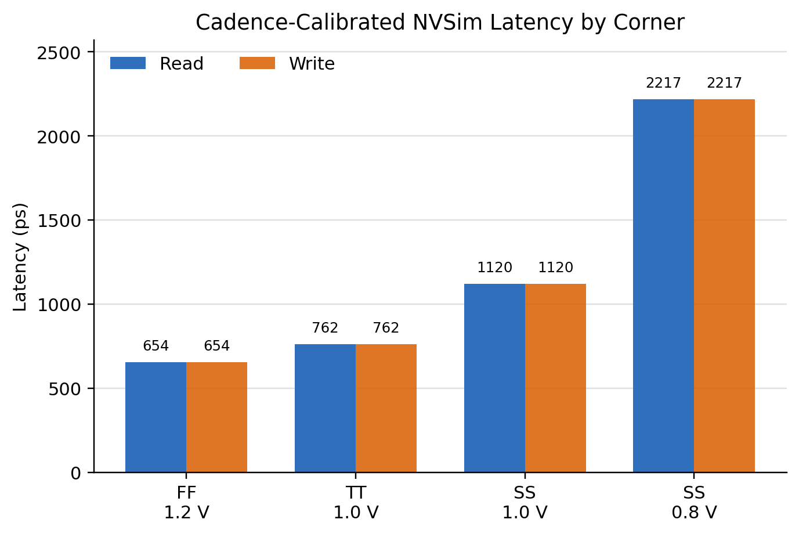
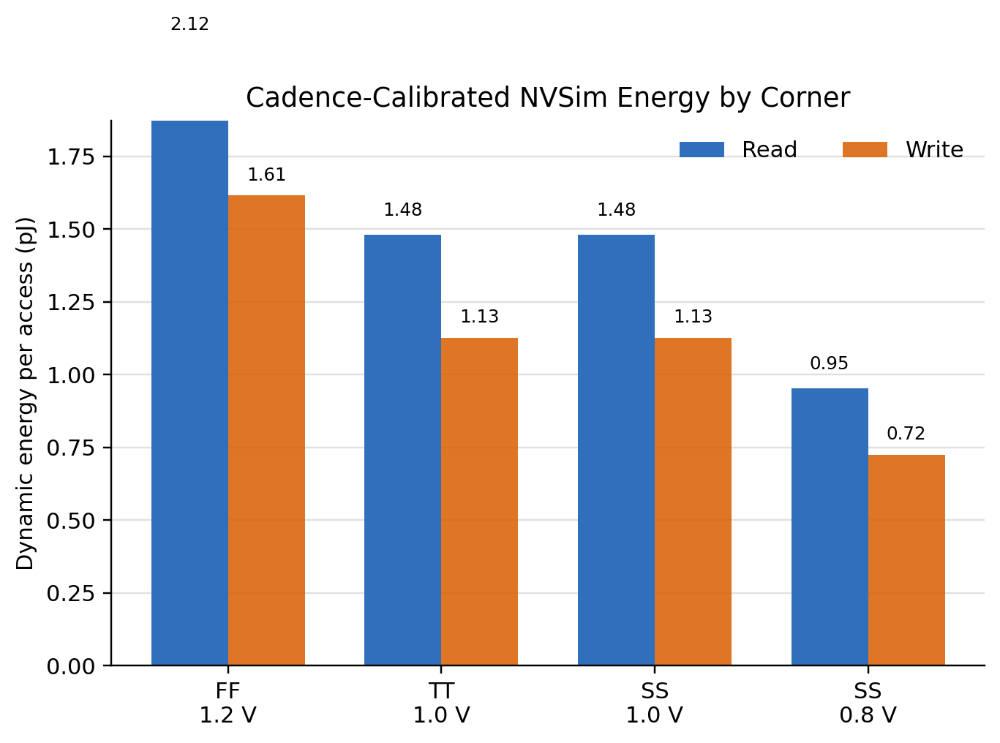
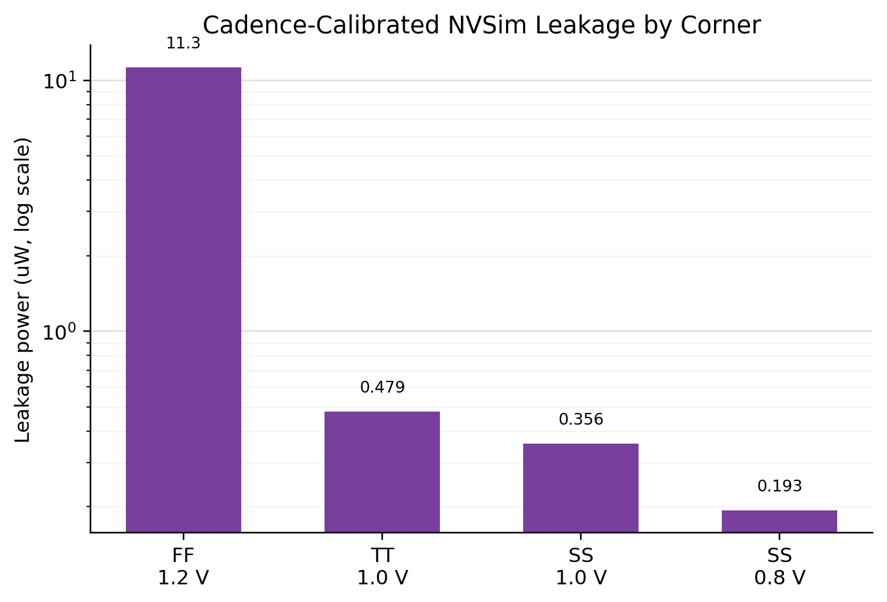
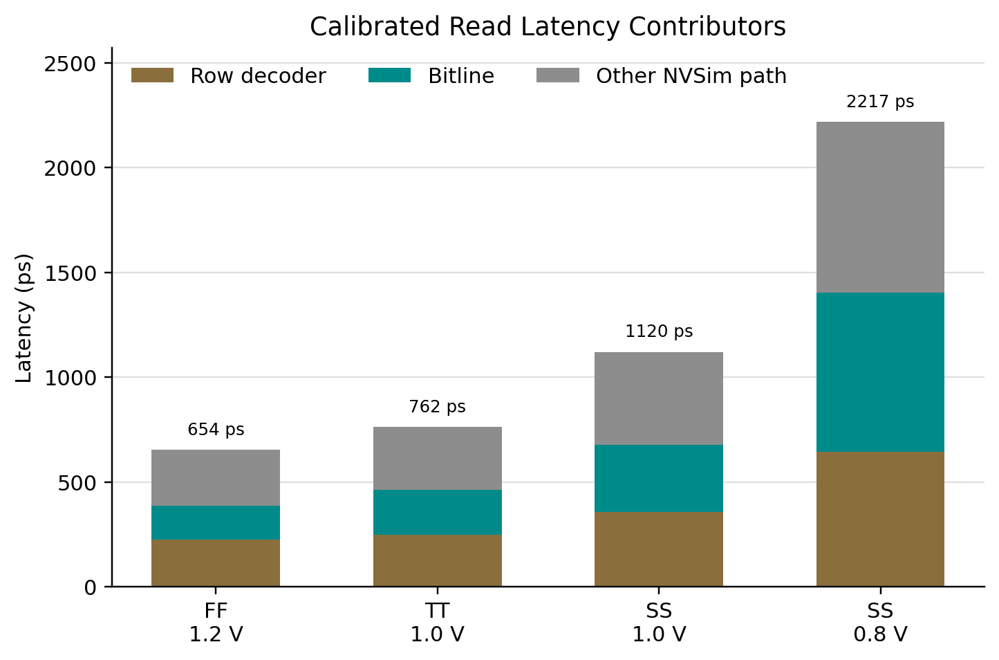
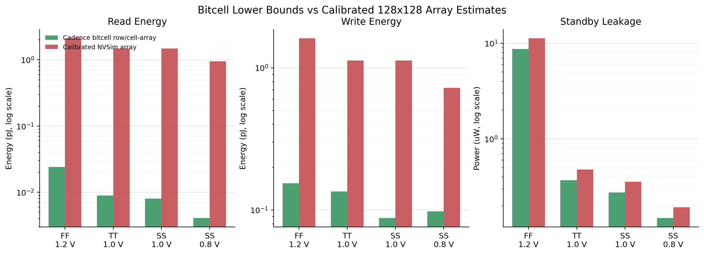
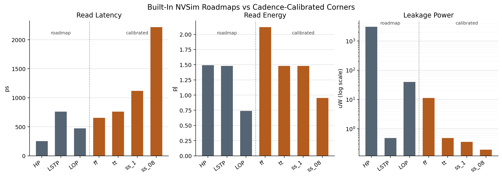

# SRAM Array Report Figures

Generated by `scripts/plot_array_figures.py` from `rw_metrics.csv` and the NVSim summaries.

## Calibrated Latency By Corner

## Calibrated Energy By Corner

## Calibrated Leakage By Corner Log

## Latency Contributors By Corner

## Array Vs Bitcell Energy Leakage

## Roadmap Vs Calibrated Summary

